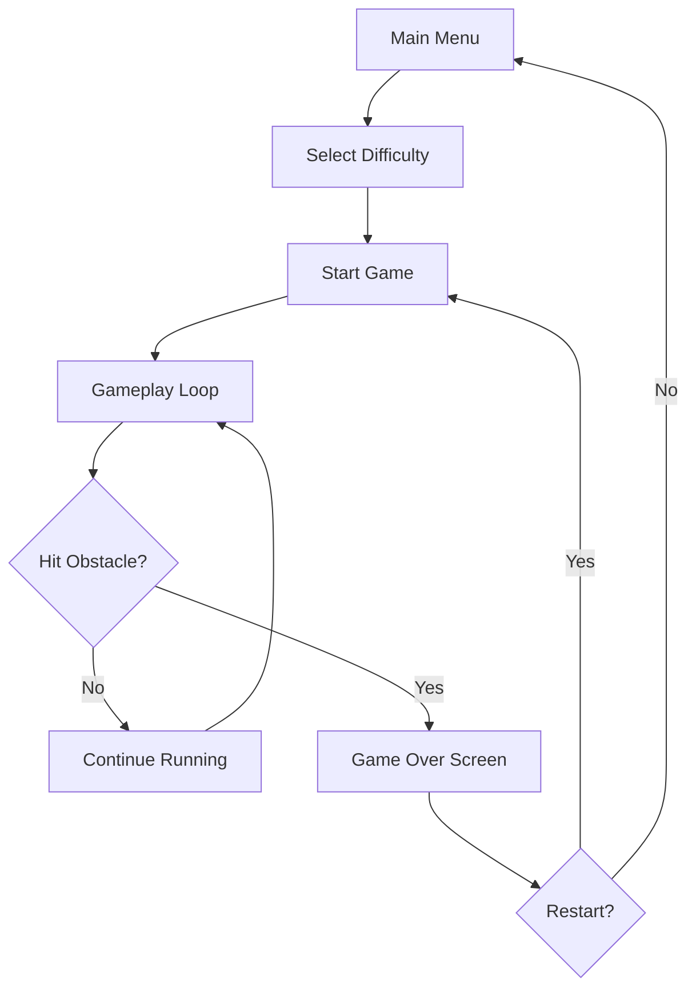

# Stickman Parkour - Product Requirements Document

## 1. Product Overview
A side-scrolling parkour game featuring a stickman character navigating through city-themed obstacle courses with increasing difficulty levels.

- **Target Users**: Casual gamers who enjoy fast-paced platformers
- **Core Value**: Addictive gameplay with smooth controls, challenging obstacles, and progressive difficulty

## 2. Core Features

### 2.1 Feature Module
1. **Stickman Character**: Animated stickman with running, jumping, and sliding animations
2. **Parkour Movement**: Run, jump, double jump, wall jump, and slide mechanics
3. **Obstacle Course**: Procedurally generated or pre-designed levels with various obstacles
4. **City Environment**: Urban-themed backgrounds with buildings, rooftops, and city elements
5. **Difficulty Levels**: Easy, Medium, Hard, and Extreme modes
6. **Score System**: Points based on distance, time, and collectibles

### 2.2 Obstacle Types
1. **Walls**: Solid barriers that require jumping over or sliding under
2. **Lasers**: Horizontal or vertical beams that must be avoided
3. **Spikes**: Ground or ceiling spikes
4. **Moving Platforms**: Platforms that move up/down or left/right
5. **Gaps**: Spaces between platforms requiring precise jumps
6. **Falling Debris**: Objects that fall from above

### 2.3 Page Details
| Page Name | Module Name | Feature Description |
|-----------|-------------|---------------------|
| Main Menu | Title Screen | Start game, select difficulty, view controls |
| Game Screen | Gameplay Area | Stickman movement, obstacles, score display |
| Pause Menu | Pause Overlay | Resume, restart, or quit options |
| Game Over | Score Display | Final score, restart or main menu options |

## 3. Core Flow

## 4. User Interface Design

### 4.1 Design Style
- **Colors**: Dark urban palette with neon accents (cyan, magenta, yellow)
- **Typography**: Bold, blocky fonts for headers; clean monospace for scores
- **Visual Style**: Silhouette-based stickman with glowing effects
- **Background**: Parallax scrolling cityscape with day/night cycle

### 4.2 Controls
- **W / Up Arrow / Space**: Jump (press twice for double jump)
- **S / Down Arrow**: Slide
- **A/D or Left/Right**: Not used (auto-scrolling)
- **P / Escape**: Pause game

### 4.3 Game Mechanics
- **Auto-scrolling**: Level moves from right to left automatically
- **Increasing Speed**: Game speed increases as score increases
- **Lives System**: 3 lives or one-hit death mode (difficulty dependent)
- **Checkpoints**: Optional checkpoints in longer levels

### 4.4 Visual Effects
- **Particle Effects**: Dust when running, sparks on landing
- **Screen Shake**: On collision or near-miss
- **Neon Glow**: On stickman and obstacles
- **Speed Lines**: When moving fast

## 5. Difficulty Levels

### Easy Mode
- Slower scroll speed
- Fewer obstacles
- 3 lives
- Larger safe zones

### Medium Mode
- Normal scroll speed
- Standard obstacle density
- 2 lives
- Standard gaps

### Hard Mode
- Faster scroll speed
- More obstacles
- 1 life
- Smaller gaps and timing windows

### Extreme Mode
- Maximum speed
- Dense obstacle patterns
- 1 life
- Precision required
