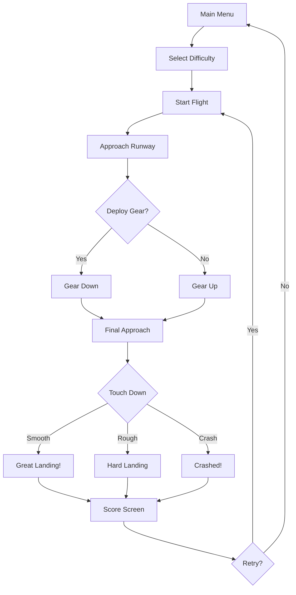

# Sky Touchdown - 3D Plane Landing Game

## 1. Product Overview
A 3D plane landing simulator where the player controls an airplane using mouse/trackpad input to land on a runway. The game focuses on smooth controls, realistic-feeling flight physics, and satisfying landing mechanics.

- **Target Users**: Casual gamers who enjoy flight/simulation games
- **Core Value**: Accessible yet challenging landing experience with intuitive mouse controls

## 2. Core Features

### 2.1 Feature Module
1. **3D Flight**: Third-person camera following the plane over terrain
2. **Mouse Control**: Mouse X-axis = bank/turn, Mouse Y-axis = pitch (nose up/down)
3. **Landing Gear**: Toggle landing gear with G key or button
4. **Altitude & Speed**: Manage descent rate and airspeed for proper landing
5. **Runway Approach**: Line up with the runway and descend at the correct angle
6. **Scoring**: Rate landings based on smoothness, speed, and alignment

### 2.2 Page Details
| Page Name | Module Name | Feature Description |
|-----------|-------------|---------------------|
| Main Menu | Title Screen | Start game, view controls, select difficulty |
| Flight Screen | 3D Flight | Plane controls, HUD with flight instruments |
| Landing Result | Score Screen | Landing grade, stats, retry option |

## 3. Core Flow

## 4. User Interface Design

### 4.1 Design Style
- **Aesthetic**: Clean aviation instrument panel — dark cockpit feel with bright instrument readouts
- **Colors**: Sky blue gradient, dark gray instruments, green/amber/red status indicators
- **Typography**: Digital instrument font (Share Tech Mono or similar)
- **Visual**: HUD overlay with altitude, speed, gear status, glide slope indicator

### 4.2 Controls
- **Mouse Movement**: Control pitch (up/down) and roll (left/right)
- **Left Click / Space**: Increase throttle (more speed)
- **Right Click / Shift**: Decrease throttle (less speed)
- **G key**: Toggle landing gear up/down
- **R key**: Reset/restart flight

### 4.3 Flight Physics
- **Gravity**: Constant downward pull
- **Lift**: Generated by speed — more speed = more lift
- **Drag**: Air resistance reduces speed over time
- **Throttle**: Controls engine power and speed
- **Banking**: Turning creates a component of lift in the turn direction

### 4.4 Landing Scoring
- **Speed at touchdown**: Ideal range 60-80 knots
- **Vertical speed**: Lower = smoother landing
- **Alignment**: How centered on the runway
- **Gear status**: Must be deployed for proper landing
- **Grades**: Perfect / Good / Hard / Crash

### 4.5 HUD Elements
- Altitude indicator (vertical bar)
- Speed indicator (digital readout)
- Throttle gauge
- Landing gear status (UP/DOWN with color)
- Vertical speed indicator
- Glideslope indicator (approach angle)

## 5. Environment
- **Terrain**: Green rolling hills with a flat runway area
- **Runway**: Gray asphalt with white centerline markings and edge lights
- **Sky**: Gradient blue sky with simple clouds
- **Water**: Blue water around the island (optional)

## 6. Difficulty Levels
- **Easy**: Slow approach speed, forgiving scoring, longer runway
- **Medium**: Standard speed, normal scoring
- **Hard**: Fast approach, strict scoring, crosswind component
