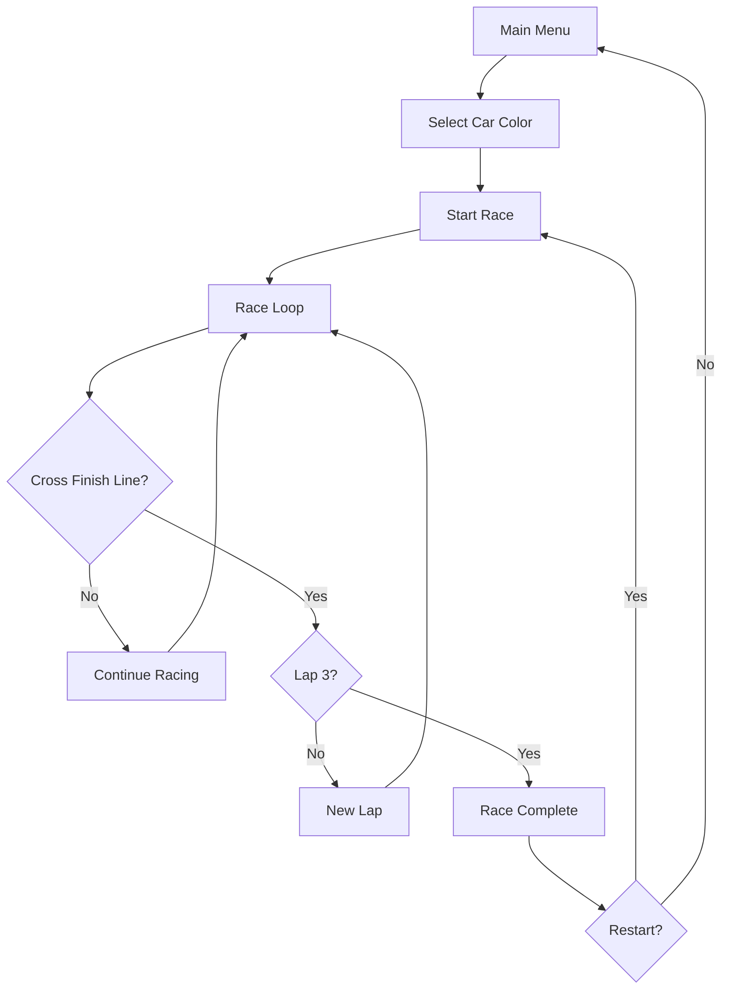

# Neon Drift Racing - Product Requirements Document

## 1. Product Overview
A 3D car racing game with a neon/cyberpunk aesthetic, featuring procedurally generated tracks, drifting mechanics, and multiple camera angles.

- **Target Users**: Casual gamers who enjoy arcade-style racing
- **Core Value**: Fast-paced racing with satisfying drift mechanics and stunning neon visuals

## 2. Core Features

### 2.1 Feature Module
1. **3D Racing**: Third-person camera following a low-poly car on a track
2. **Drift Mechanic**: Hold space/bar to drift, building boost meter
3. **Track Generation**: Procedurally generated road with curves and obstacles
4. **AI Opponents**: 3 opponent cars racing alongside you
5. **Boost System**: Drift to fill boost, release for speed burst
6. **Lap System**: Complete 3 laps to finish the race

### 2.2 Page Details
| Page Name | Module Name | Feature Description |
|-----------|-------------|---------------------|
| Main Menu | Title Screen | Start race, select car color, view controls |
| Race Screen | 3D Racing | Car controls, track, opponents, HUD |
| Race Complete | Results | Final position, time, restart option |

## 3. Core Flow

## 4. User Interface Design

### 4.1 Design Style
- **Aesthetic**: Cyberpunk neon — dark backgrounds with glowing neon lines
- **Colors**: Deep black (#0a0a0f), neon cyan (#00ffff), neon magenta (#ff00ff), neon yellow (#ffff00), hot orange (#ff6600)
- **Typography**: Bold display font for titles, monospace for stats
- **Visual**: Glowing road edges, particle trails, speed lines

### 4.2 Controls
- **W / Up Arrow**: Accelerate
- **S / Down Arrow**: Brake / Reverse
- **A / Left Arrow**: Steer Left
- **D / Right Arrow**: Steer Right
- **Space**: Drift (hold while turning to drift and build boost)
- **Shift**: Use boost

### 4.3 Game Mechanics
- **Drifting**: Press space while turning — car slides sideways, boost meter fills faster
- **Boost**: When meter is full, press shift for a speed burst
- **Off-road**: Driving off the track slows you down significantly
- **Collision**: Hitting walls or opponents slows you down briefly
- **Laps**: 3 laps per race, timer counts total race time

### 4.4 HUD Elements
- Speedometer (digital)
- Boost meter (neon bar)
- Current position (1st/2nd/3rd/4th)
- Lap counter (Lap X/3)
- Race timer

## 5. Technical Approach

### 5.1 3D Rendering
- **Three.js** via @react-three/fiber for React integration
- **Low-poly aesthetic** with emissive neon materials
- **Post-processing**: Bloom effect for neon glow
- **Skybox**: Dark gradient with distant neon city silhouette

### 5.2 Track Design
- Track built from segments (straights, curves)
- Neon edge lines on road boundaries
- Road surface: dark asphalt with subtle grid pattern
- Guardrails with glowing tops

### 5.3 Car Physics
- Simple arcade physics (not realistic simulation)
- Forward velocity with acceleration/deceleration
- Steering with drift modifier
- No complex tire physics — fun over realism
