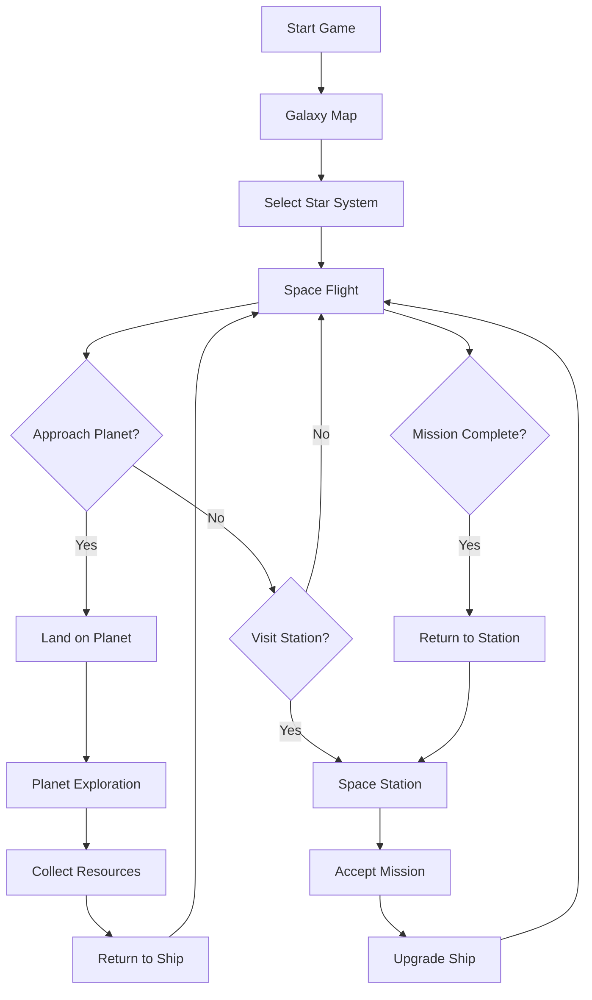

# Stellar Voyager - Product Requirements Document

## 1. Product Overview
A 2D space exploration game where players pilot a spaceship through a procedurally generated galaxy, discovering planets, collecting resources, and completing missions.

- **Target Users**: Casual gamers who enjoy exploration and discovery
- **Core Value**: Provides a relaxing yet engaging space exploration experience with freedom to roam and meaningful tasks

## 2. Core Features

### 2.1 Feature Module
1. **Space Navigation**: Fly spaceship freely across star systems
2. **Planet Exploration**: Land on and explore diverse planets
3. **Resource Collection**: Gather materials from planets and asteroids
4. **Mission System**: Accept and complete various tasks
5. **Ship Upgrades**: Improve spaceship capabilities
6. **Discovery Log**: Track explored locations and findings

### 2.2 Page Details
| Page Name | Module Name | Feature Description |
|-----------|-------------|---------------------|
| Galaxy Map | Star System Navigation | View and select star systems to travel to |
| Space Flight | Spaceship Control | Real-time spaceship movement and interaction |
| Planet Surface | Exploration Mode | Walk/rover on planet surface, collect resources |
| Space Station | Mission Hub | Accept missions, trade resources, upgrade ship |
| Inventory | Resource Management | View collected resources and items |
| Discovery Log | Progress Tracking | Record of explored planets and discoveries |

## 3. Core Flow

## 4. User Interface Design

### 4.1 Design Style
- **Colors**: Deep space blacks (#0a0a0f), nebula purples (#6b21a8), stellar blues (#0ea5e9), accent yellows (#fbbf24)
- **Typography**: Space-themed monospace for UI, clean sans-serif for text
- **Layout**: HUD-style overlay with minimal UI elements
- **Visual Effects**: Particle stars, glowing planets, engine trails

### 4.2 Page Design Overview
| Page Name | Module Name | UI Elements |
|-----------|-------------|-------------|
| Galaxy Map | Star System View | 2D star map with clickable systems, info tooltips |
| Space Flight | Main Game View | Spaceship sprite, background stars, minimap |
| Planet Surface | Exploration View | Terrain tiles, resource indicators, character sprite |
| Space Station | Station Interior | Menu-based interface with mission boards |
| Inventory | Item Grid | Grid layout with item icons and quantities |
| Discovery Log | List View | Scrollable list with planet details and images |

### 4.3 Responsiveness
- Desktop-first design
- Keyboard controls for spaceship movement
- Mouse for UI interactions and planet selection
- Touch support for mobile devices (future consideration)

### 4.4 Game Mechanics
- **Movement**: WASD or arrow keys for spaceship control
- **Interaction**: Click or spacebar to interact with objects
- **Resource Collection**: Automatic when near resource nodes
- **Mission Tracking**: Side panel showing active objectives
