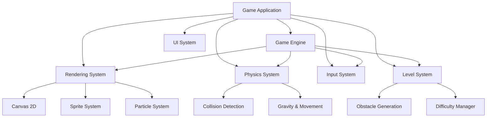

# Stickman Parkour - Technical Architecture

## 1. Architecture Design


## 2. Technology Description
- **Frontend**: React 18 + TypeScript + Vite
- **Rendering**: HTML5 Canvas 2D API
- **Styling**: Tailwind CSS for UI overlays
- **State Management**: Zustand for game state
- **Build Tool**: Vite with React plugin

## 3. Core Systems

### 3.1 Game Engine
- **Game Loop**: requestAnimationFrame with fixed timestep (60 FPS)
- **Delta Time**: Frame-independent movement calculations
- **Camera System**: Follows player with smooth scrolling

### 3.2 Stickman Character
```typescript
interface Stickman {
  x: number
  y: number
  velocityX: number
  velocityY: number
  width: number
  height: number
  state: 'running' | 'jumping' | 'falling' | 'sliding' | 'dead'
  animationFrame: number
  lives: number
  isGrounded: boolean
  canDoubleJump: boolean
  isSliding: boolean
}
```

### 3.3 Physics System
- **Gravity**: Constant downward force
- **Jump Force**: Upward impulse on jump input
- **Slide**: Reduced hitbox and speed boost
- **Collision**: AABB collision detection with obstacles

### 3.4 Obstacle Types
```typescript
interface Obstacle {
  type: 'wall' | 'laser' | 'spike' | 'gap' | 'moving_platform' | 'debris'
  x: number
  y: number
  width: number
  height: number
  speed?: number
  direction?: 'up' | 'down' | 'left' | 'right'
  isActive: boolean
}
```

### 3.5 Level Generation
- **Procedural**: Random obstacle placement based on difficulty
- **Pattern-Based**: Pre-defined obstacle patterns that repeat
- **Difficulty Scaling**: Speed and density increase over time

### 3.6 Rendering System
- **Stickman**: Animated stick figure with joint-based animation
- **Background**: Parallax scrolling city layers
- **Obstacles**: Simple geometric shapes with glow effects
- **Particles**: Dust, sparks, and trail effects

## 4. Game State
```typescript
interface GameState {
  screen: 'menu' | 'playing' | 'paused' | 'gameover'
  difficulty: 'easy' | 'medium' | 'hard' | 'extreme'
  score: number
  distance: number
  highScore: number
  speed: number
  player: Stickman
  obstacles: Obstacle[]
  platforms: Platform[]
  camera: { x: number; y: number }
}
```

## 5. Rendering Pipeline

### 5.1 Draw Order
1. Background (parallax layers)
2. Platforms
3. Obstacles
4. Player (stickman)
5. Particles
6. UI overlay (score, lives)

### 5.2 Animation System
- **Running**: 6-frame cycle for leg movement
- **Jumping**: Arms up pose
- **Sliding**: Low profile pose
- **Death**: Ragdoll or explosion effect

## 6. Performance Considerations
- **Object Pooling**: Reuse obstacle objects
- **Off-screen Culling**: Only render visible objects
- **RequestAnimationFrame**: Smooth 60 FPS target
- **Minimal DOM Updates**: Canvas-based rendering

## 7. Implementation Plan

### Phase 1: Core Engine
- Set up React + Vite project
- Implement game loop and canvas rendering
- Create stickman character with basic movement

### Phase 2: Physics & Collision
- Add gravity and jump mechanics
- Implement AABB collision detection
- Add platform and ground support

### Phase 3: Obstacles & Levels
- Create obstacle types (walls, lasers, spikes)
- Implement procedural level generation
- Add difficulty scaling

### Phase 4: Visual Polish
- Add parallax background
- Implement particle effects
- Add neon glow effects
- Create UI overlays

### Phase 5: Game Flow
- Main menu screen
- Pause functionality
- Game over screen with high scores
