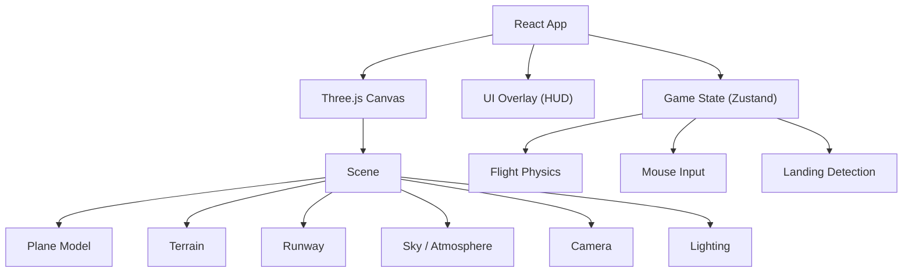

# Sky Touchdown - Technical Architecture

## 1. Architecture Design


## 2. Technology Description
- **Frontend**: React 18 + TypeScript + Vite
- **3D Engine**: Three.js via @react-three/fiber + @react-three/drei
- **Styling**: Tailwind CSS for HUD overlays
- **State Management**: Zustand
- **Build Tool**: Vite

## 3. Core Systems

### 3.1 3D Scene Structure
```typescript
Scene
├── Sky (gradient background)
├── DirectionalLight (sun)
├── AmbientLight
├── Terrain (green plane with height variation)
├── Runway (dark gray box with markings)
├── Plane Group
│   ├── Fuselage (elongated box)
│   ├── Wings (flat boxes)
│   ├── Tail (vertical + horizontal stabilizers)
│   ├── Engines (cylinders under wings)
│   └── Landing Gear (3 wheel groups, toggle visibility)
├── Camera (third-person follow)
└── Clouds (simple sphere groups)
```

### 3.2 Flight Physics Model
```typescript
interface FlightState {
  position: Vector3
  rotation: Euler // pitch, yaw, roll
  velocity: Vector3
  speed: number // knots
  altitude: number
  verticalSpeed: number
  throttle: number // 0-1
  gearDeployed: boolean
  onGround: boolean
  bankAngle: number
  pitchAngle: number
}
```

### 3.3 Mouse Control Mapping
- **Mouse X movement**: Controls roll/bank angle
  - Move left = bank left
  - Move right = bank right
  - Center = level flight
- **Mouse Y movement**: Controls pitch
  - Move up = nose up (climb)
  - Move down = nose down (descend)
  - Center = maintain altitude

### 3.4 Landing Detection
- Detect when plane's Y position reaches terrain height
- Calculate vertical speed at touchdown
- Check if landing gear is deployed
- Check alignment with runway center
- Check speed is within safe range
- Calculate landing score

### 3.5 Camera System
- Third-person camera behind and above plane
- Camera looks at the plane
- Smooth follow with lerp
- Slight offset in the direction of travel

## 4. Data Model

### 4.1 Game State
```typescript
interface GameState {
  screen: 'menu' | 'flying' | 'result'
  difficulty: 'easy' | 'medium' | 'hard'
  flight: FlightState
  score: number
  landingGrade: 'Perfect' | 'Good' | 'Hard' | 'Crash' | null
  touchdownSpeed: number
  touchdownVerticalSpeed: number
}
```

## 5. Implementation Plan

### Phase 1: Project Setup
- Initialize React + Vite project
- Install Three.js dependencies
- Set up basic 3D scene with sky and ground

### Phase 2: Plane & Controls
- Build low-poly plane model
- Implement mouse-based flight controls
- Add flight physics (lift, drag, gravity)

### Phase 3: Terrain & Runway
- Create terrain with runway
- Add runway markings and lights
- Position plane for approach

### Phase 4: Landing Mechanics
- Landing gear toggle (G key)
- Touchdown detection
- Landing scoring system
- Result screen

### Phase 5: HUD & Polish
- Flight instruments overlay
- Altitude/speed readouts
- Gear status indicator
- Menu and result screens
