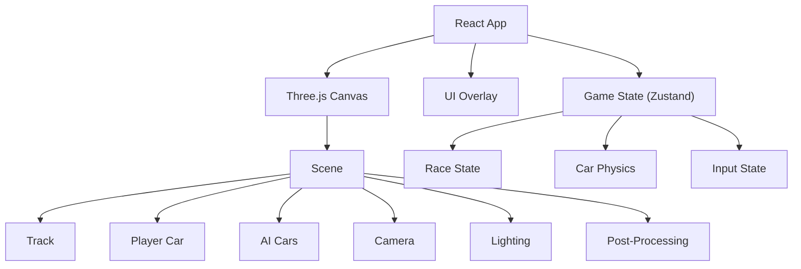

# Neon Drift Racing - Technical Architecture

## 1. Architecture Design


## 2. Technology Description
- **Frontend**: React 18 + TypeScript + Vite
- **3D Engine**: Three.js via @react-three/fiber + @react-three/drei
- **Post-Processing**: @react-three/postprocessing (Bloom effect)
- **Styling**: Tailwind CSS for UI overlays
- **State Management**: Zustand
- **Build Tool**: Vite

## 3. Route Definitions
| Route | Purpose |
|-------|---------|
| / | Main game application (single page) |

## 4. Core Systems

### 4.1 3D Scene Structure
```typescript
// Scene hierarchy
Scene
├── AmbientLight + DirectionalLight
├── Track (procedural road mesh)
│   ├── Road surface (dark asphalt)
│   ├── Neon edge lines (emissive cyan/magenta)
│   └── Guardrails
├── Player Car
│   ├── Car body (low-poly box geometry)
│   ├── Wheels (cylinder geometry)
│   └── Headlights (point lights)
├── AI Cars (x3)
│   └── Same structure as player car
├── Camera (third-person follow)
└── PostProcessing
    └── Bloom (for neon glow)
```

### 4.2 Car Physics Model
```typescript
interface CarPhysics {
  position: Vector3
  rotation: number // Y-axis rotation in radians
  speed: number // current forward speed
  maxSpeed: number
  acceleration: number
  deceleration: number
  steerAngle: number
  steerSpeed: number
  driftFactor: number // 0-1, higher = more drift
  boostMeter: number // 0-100
  isBoosting: boolean
  isDrifting: boolean
}
```

### 4.3 Track Generation
- Track is a closed loop made of segments
- Each segment has: position, direction, type (straight/curve-left/curve-right)
- Road mesh built from segment waypoints
- Neon lines follow road edges
- Track total length determines lap distance

### 4.4 Camera System
- Third-person camera behind and above the car
- Smooth follow with lerp interpolation
- Camera rotates with car direction
- Slight tilt during drift for dramatic effect

### 4.5 AI Behavior
- AI cars follow the track spline
- Varying speeds (slightly slower than max player speed)
- Simple obstacle avoidance (steer away from walls)
- Random speed variation for natural feel

## 5. Data Model

### 5.1 Game State
```typescript
interface RaceState {
  screen: 'menu' | 'racing' | 'complete'
  lap: number // 1-3
  totalLaps: number
  position: number // 1-4
  raceTime: number
  bestLapTime: number
  carColor: string
  isRacing: boolean
}
```

### 5.2 Track Segment
```typescript
interface TrackSegment {
  id: number
  position: { x: number; y: number; z: number }
  direction: number // angle in radians
  type: 'straight' | 'curve-left' | 'curve-right'
  width: number
}
```

## 6. Implementation Plan

### Phase 1: Project Setup
- Initialize React + Vite project
- Install Three.js dependencies
- Set up basic 3D scene

### Phase 2: Track & Car
- Create procedural track
- Build low-poly car model
- Implement car physics

### Phase 3: Racing Mechanics
- Add AI opponents
- Implement lap counting
- Add drift and boost mechanics

### Phase 4: Visual Polish
- Add neon glow (Bloom)
- Particle effects (sparks, boost trail)
- HUD overlay
- Main menu and race complete screens

### Phase 5: Audio & Polish
- Engine sound
- Drift screech
- Boost whoosh
- Background music (optional)
