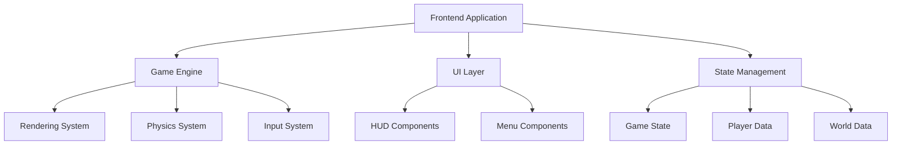

# Stellar Voyager - Technical Architecture

## 1. Architecture Design


## 2. Technology Description
- **Frontend**: React 18 + TypeScript + Vite
- **Game Engine**: Custom 2D engine using HTML5 Canvas
- **Styling**: Tailwind CSS for UI components
- **State Management**: Zustand for game state
- **Build Tool**: Vite with React plugin
- **No Backend**: Single-player client-side game

## 3. Route Definitions
| Route | Purpose |
|-------|---------|
| / | Main game screen |
| /menu | Main menu with start/load options |
| /inventory | Inventory management screen |
| /log | Discovery log and achievements |

## 4. Core Systems

### 4.1 Game Engine
- **Rendering**: HTML5 Canvas 2D context
- **Game Loop**: requestAnimationFrame with fixed timestep
- **Entity System**: Simple ECS-like pattern for game objects
- **Collision Detection**: AABB for basic collision

### 4.2 World Generation
- **Galaxy**: Procedurally generated star systems
- **Planets**: Random terrain generation with resource distribution
- **Space Stations**: Fixed locations with mission generation

### 4.3 Player Systems
- **Movement**: Physics-based spaceship control
- **Inventory**: Grid-based item storage
- **Progression**: Experience and upgrade system

## 5. Data Model

### 5.1 Core Entities
```typescript
interface StarSystem {
  id: string;
  name: string;
  position: { x: number; y: number };
  planets: Planet[];
  stations: SpaceStation[];
}

interface Planet {
  id: string;
  name: string;
  type: 'rocky' | 'gas' | 'ice' | 'volcanic';
  resources: Resource[];
  terrain: number[][];
  discovered: boolean;
}

interface SpaceStation {
  id: string;
  name: string;
  missions: Mission[];
  upgrades: Upgrade[];
}

interface Player {
  position: { x: number; y: number };
  inventory: InventoryItem[];
  ship: ShipStats;
  missions: Mission[];
  discoveries: string[];
}
```

### 5.2 Game State
```typescript
interface GameState {
  currentSystem: string;
  currentPlanet: string | null;
  player: Player;
  world: {
    systems: StarSystem[];
    generatedChunks: Set<string>;
  };
  ui: {
    screen: 'game' | 'menu' | 'inventory' | 'log';
    activeMission: Mission | null;
  };
}
```

## 6. Implementation Plan

### Phase 1: Core Engine
- Set up React + Vite project
- Implement basic game loop and rendering
- Create spaceship movement and controls

### Phase 2: World Generation
- Procedural galaxy generation
- Planet terrain generation
- Resource placement system

### Phase 3: Game Systems
- Mission system implementation
- Inventory and resource management
- Ship upgrade mechanics

### Phase 4: Polish & UI
- HUD and UI components
- Visual effects and particles
- Sound effects and music (optional)
